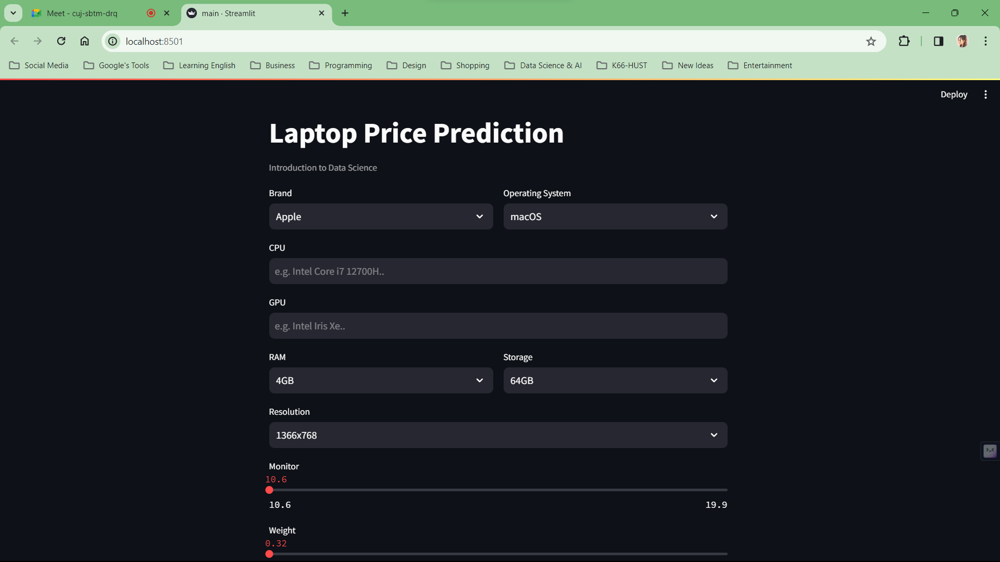
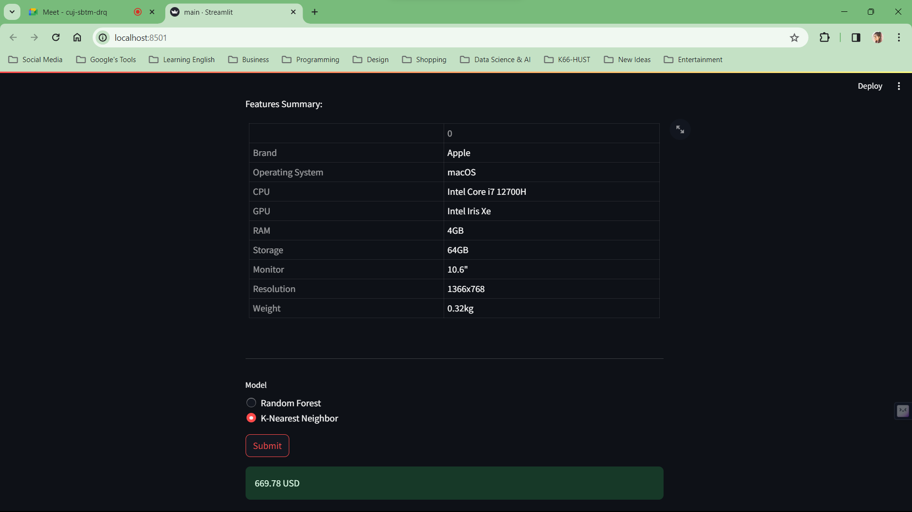

<<<<<<< HEAD
# laptop-price-prediction
=======
## Problem Description
The objective of this project are **analyze laptop prices** in 2023 based on data scraped from multiple websites and **predict a product's price** from a given set of input

- **Input**: Brand, CPU, GPU, RAM, Storage,...

- **Output**: Price

- **Demo**:



- **Results**:



## Installation

1. Open terminal and clone the project
    ```
    
    ```

2. Open terminal and install libraries
    ```
    pip install requirements.txt
    ```

3. Run Streamlit on `/laptop-prices-analysis> `
    ```
    streamlit run main.py
    ```

> [!NOTE]  
> If you have trouble installing `streamlit` library, please refer to this [tutorial](https://youtu.be/aIk1WpRJZzA?si=oVIpYmCh1oIcLiWF)

## Contributions
|Name|Student ID|Email|
|-|:-:|-|
|Nguyen Xuan Huy|B21DCCN438|nxh27012003@gmail.com|


>>>>>>> 9eb9ee2 (Initial commit or update description)
